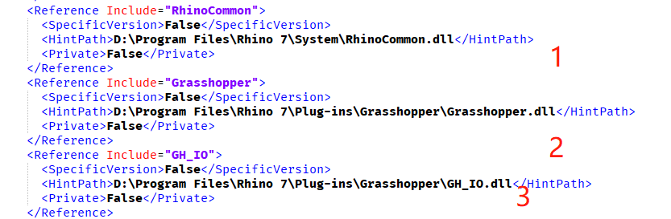
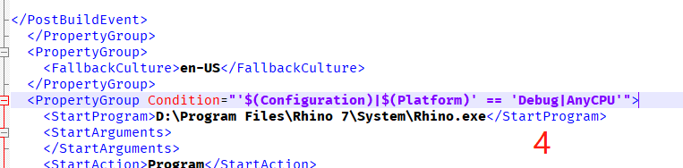
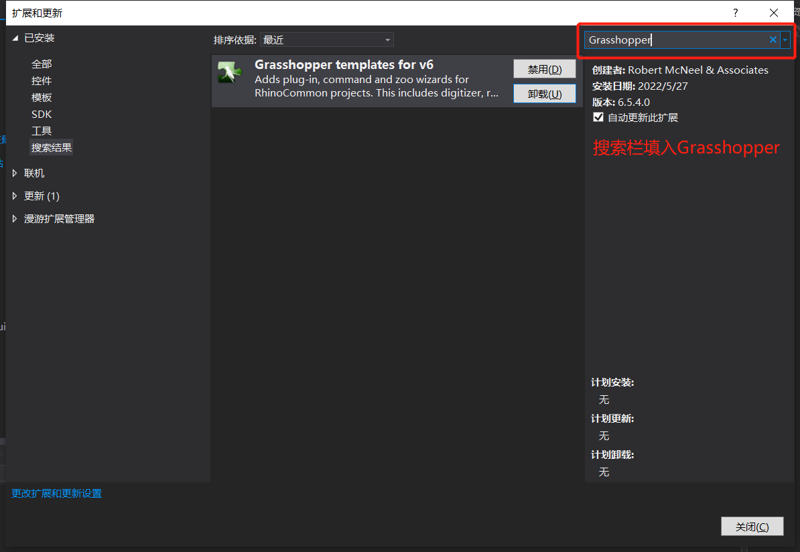
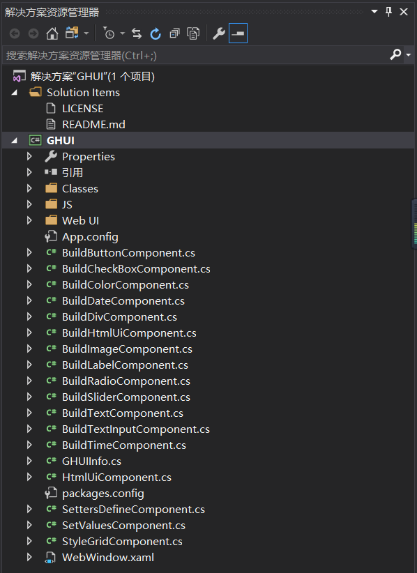
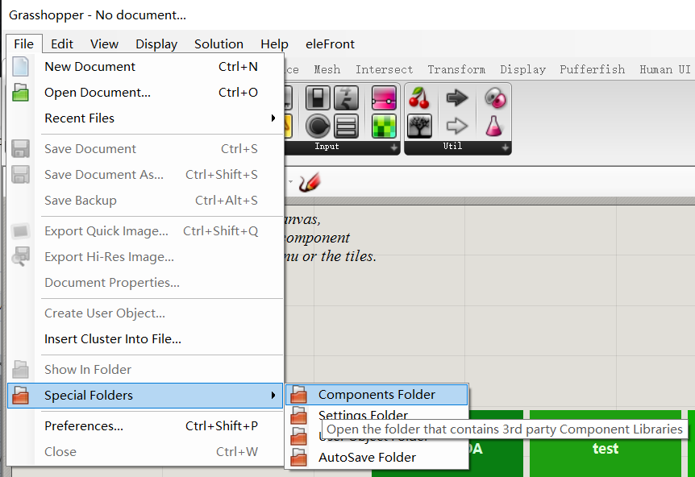
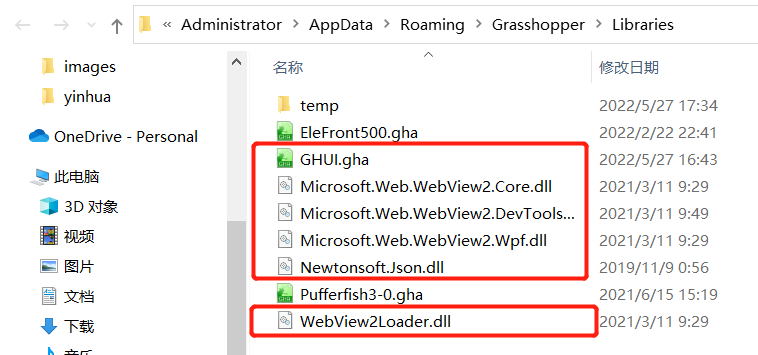
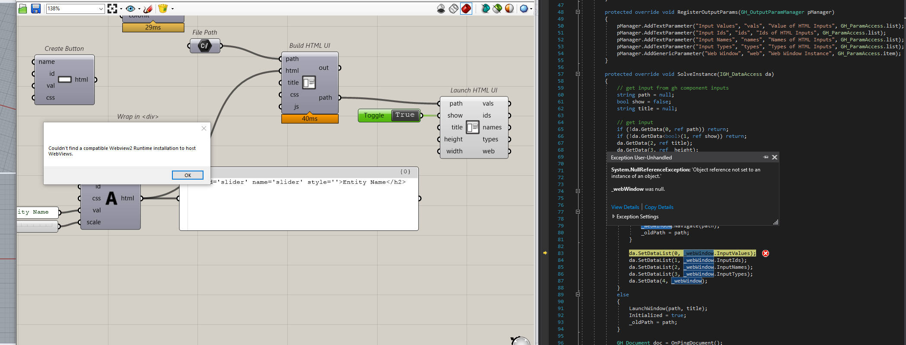
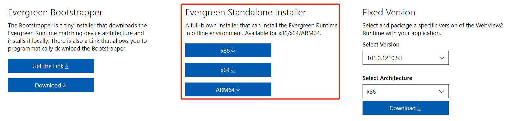

## GHUI库

1. github源码地址（带demo）：https://github.com/mitevpi/gh-web-ui
2. Release版本地址：https://github.com/mitevpi/gh-web-ui/releases
3. 要求：Windows系统

## GHUI安装流程

1. 在上述Github库中下载Release的0.2.0版本的Source code到本地解压

2. 修改GHUI.csproj中和rhino及grasshopper的dll的有关路径

   

   

   

3. 下载安装Visual Studio2017或者以上版本（这里以Visual Studio2017为例），同时安装Grasshopper插件开发扩展工具

   安装方式：VS菜单栏“工具”->“扩展与更新”->搜索Grasshopper插件并安装

   

4. 安装完毕后重启Visual Studio并且打开下载好且更改了路径的源码文件（打开GHUI.sln），并在生成菜单中点击“生成解决方案”或者按快捷键F7

   

5. 完成之后GHUI.gha和其他一些dll已经复制到```%appData%/grasshopper/Libraries```了，再次打开grasshopper应该能看到UI这个插件

   

   

6. 可以尝试打开源码文件中附带的例子比如ServerInterface.gh，如果显示页面时遇到以下提示：

   

   说明未安装WebView2，到以下地址下载安装webview2：https://developer.microsoft.com/en-us/microsoft-edge/webview2/#download-section

   注意选择Evergreen Standalone Installer版本（根据自己电脑的位数安装对应版本）

   

7. 全部安装完毕之后可再次打开ServerInterface.gh文件，会发现错误提示不再出现。

